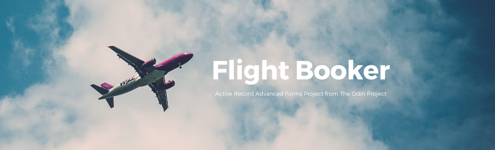
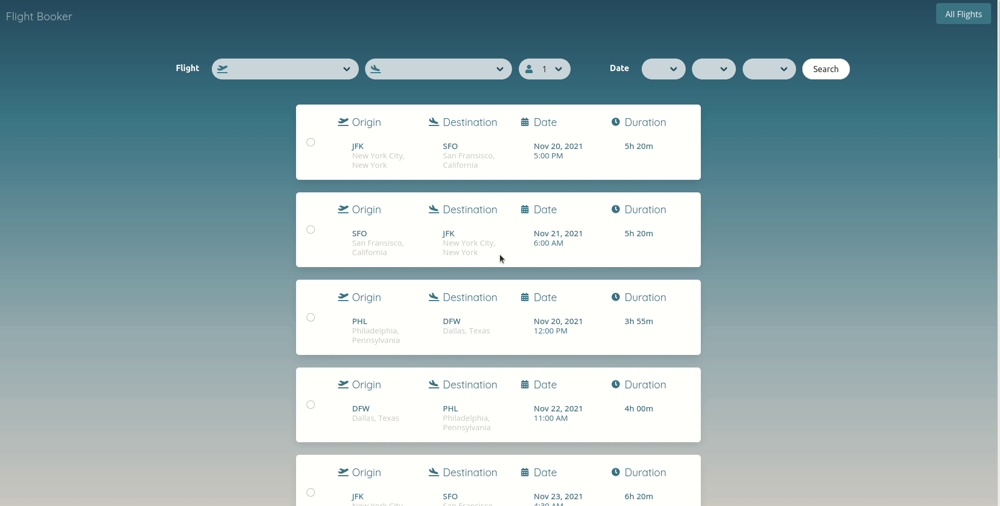

# Project: Flight Booker
A project built for [The Odin Project Ruby on Rails Course](https://www.theodinproject.com/courses/ruby-on-rails/lessons/building-advanced-forms) to gain experience building Advanced Forms with Active Record. The website acts as a flight booking app to book one-way flights. Users can input any number of passenger for their booking and select their desired journey. 

## Features
The seed file contains prepopulated airports with their codes and locations, along with flights to and from each airport with dates and durations. 

Users can search all flights, based on origin, destination, and date. If no date is selected, it will show all possible flights for the origin and destination airports. Additionally, if only a date is selected, the resulting flights will be all flights on that date. 

The user clicks on the radio button the left of each flight to select it, and use the Submit button to start a booking. Once on the booking page, the user can input the personal information for each passenger on the booking. The number of passengers is determined by the search input from the previous page. 

Once a booking is created, the user can see the details of the flight and passengers. However, the booking cannot be edited or deleted.

Design was not a requirement for the project, however, I added styling using the [Bulma](https://bulma.io/) gem, which is a great flex-box based, open-source CSS framework. 

## Demo 
Check out the live version here: [Link](https://salty-bastion-40242.herokuapp.com/)

The live site has been seeded with flights. 

## Gems Used 
* [Bulma](https://bulma.io/)
* [Better Errors](https://github.com/BetterErrors/better_errors)

## Reflections 
Personally, the hardest aspect of this project was getting the search button functioning. In retrospect, I realize the problem was rather simple, and straightforward, but initially when I faced the roadblock, I really had no idea what to do. I am continuously grateful for the amazing community of the Odin Project, who guided me through my code, and gave me advice without completely handing me the answers. It truly helped my understanding of Advanced Forms in Rails. 

Also, in this project, I separated my tasks into two groups. Functionality, and then Design. By focusing my efforts on the functionalities first, I had fewer bugs to deal with while designing. It was an eye-opening experience. However, the greatest improvement I made was not in the speed of coding my views, but in my ability to create an user experience with a smooth flow. I'm able to manipulate the css easily and know exactly what elements I need to target. The process definitely became more pleasurable, and I am very happy with the way this website turned out.

As always with any deployment, I ran into an issue that I'd never seen before. The error I kept getting was a Relation does not exist error. Though I did a thorough search online for any possible clues, I was not able to find the exact issue. However, with more thought and mediation, I did discover what the original issue was. When I first created the migrations files, I preemptively created my booking table, referencing the passengers table without having first created the passengers table. This lesson taught me the importance of building up your database in a coherent way, and making sure that relations in tables need to be created after all tables in the relation has been created. 